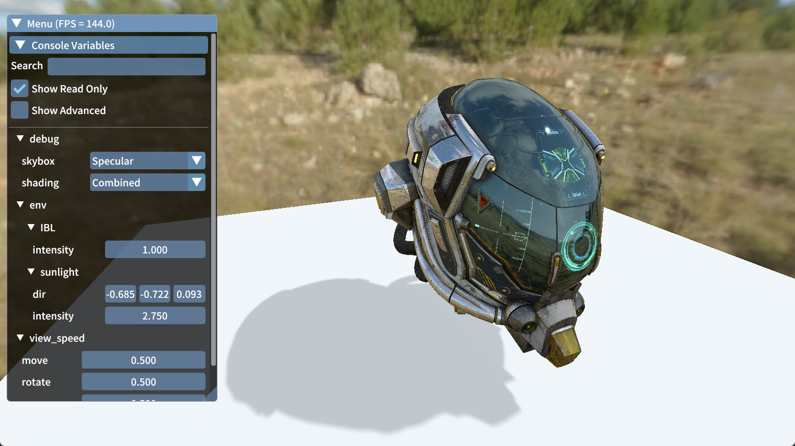

# LumiEngine [](https://opensource.org/licenses/MIT)
A simple Vulkan renderer.



## Features

- [ ] PBR
    - [x] Image Based Lighting (IBL)
- [ ] Shadow
    - [x] Simple PCF
    - [ ] PCSS


## Prerequisites
- Visual Studio >= 2022
- CMake >= 3.20
- Vulkan SDK >= 1.3.250.0

## Build

```shell
git clone https://github.com/LumiOwO/LumiEngine.git --recursive
cd LumiEngine
cmake -S . -B build
```
Then open the Visual Studio solution in the build directory and build it manually.


## License
[MIT License](LICENSE)

## References
- [Vulkan Guide](https://vkguide.dev/)
- [Vulkan Tutorial](https://vulkan-tutorial.com/)
- [Piccolo (formerly Pilot) – mini game engine for games104](https://github.com/BoomingTech/Piccolo)
- [Vulkan C++ examples and demos](https://github.com/SaschaWillems/Vulkan)
- [Physical based rendering with Vulkan using glTF 2.0 models](https://github.com/SaschaWillems/Vulkan-glTF-PBR)
- [glTF Sample Models](https://github.com/KhronosGroup/glTF-Sample-Models)

## Todos

- [x] Index buffer
- [x] Instanced rendering
- [x] PBR
- [x] Shadow map
- [ ] MSAA
- [ ] SSAO
- [ ] vsync
- [ ] Defered shading
